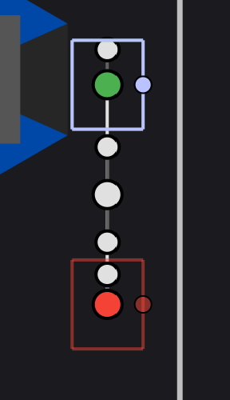

# Autonomous Control Tutorial

## Main Steps

* [Understanding Autonomous](#understanding-auto)
  * [The logic](#the-logic-of-autonomous)
  * [Example path](#example-path)
* [Using Autonomous method](#using-autonomous-method)
  * [Autonomous points](#autonomous-points)
  * [Example code](#example-code)
* [How to add new autos](#how-to-add-new-autos)
  * [Configuring Robot.java](#configuring-robotjava)
  * [Adding The Auto](#adding-the-auto)
* [Creating an straight right auto](#creating-a-straight-right-auto)
  * [Initialization](#initialization)
  * [Creating the points](#creating-the-points)
  * [Adding new auto to ``AutonomousChooser``](#adding-new-auto-to-autonomouschooser)

**Note: Before starting to this tutorial it is highly recommended to check out:** [axis slideshow](https://docs.google.com/presentation/d/1xlLosj8OtDT4ZYPmwNYCTpfssbvDBzSez2gjf2qjXp4/edit#slide=id.g2f014a1c21b_1_10)

## Understanding Auto

### The logic of autonomous

* At the start of each competetion there is a part where the robot should function automatiacally which is called **autonomous**.
* In our code the way autonous works is that the robot tries to move from an initial position, passes from a middle position, and finishes in the end position.
* In intial position we give the robot a direction which the robot is going to leave, called heading. We do the same in the end point by giving it an arriving heading.

### Example Path


* In the picture our initial point is where the green dot is at, the heading is 0 degrees which means forward in this example.
* The middle point is the big white dot that is in the above in our code it doesn't have heading it is only a point where the robot passes through
* The end point is the red dot in the right, and its heading is 180 degrees, meaning that the robot **arrive** to the end point from the 180 degrees.

## Using Autonomous Method

### Autonomous Points

The methods parameters are the following:

```java
createPath(
    initial_position,
    middle_point,
    final_position,
    final_rotation
)
```

Initial position: it requires a Pose2d type meaning that it wants a x-position, y-position, rotation(in radian), x and y position are for the positioning and the rotation is for heading.

Middle point: it requires a Translation2d meaning it wants a x-position and a y-position. It doesn't do anything with the heading.

Final position: it requires a Pose2d type meaning that it wants a x-position, y-position, rotation(in radian), x and y position are for the positioning and the rotation is for heading.

Final rotaion: it requires an integer and it decides on the final rotation, if left blank it will automatically be 0.

Return: It returns a command which will move the robot in the given points.

### Example code

```java
m_dts.createPath(
        new Pose2d(0,0, new Rotation2d(Math.toRadians(90))),
        new Translation2d(0, 0.5),
        new Pose2d(0, 1, new Rotation2d(Math.toRadians(90))),
        0
)
```

In this example the intial position is at the coordinates (0, 0) and the robot's leaving heading is 90 degrees. the middle point is at the point (0, 0.5) meaning that the bot would go straight 0.5m. And the final point is at the coordinates (0, 1) and its arriving heading is 90 degrees meaning front according to our coordinates.

So the auto would look something like this:


## How to add new autos

* In order to choose from multiple autos, we need to create a sendableChooser which we will be adding all of our autos and they will be chooseable from ``ShuffleBoard``.

### Configuring Robot.java

* Start with creating a new sendableChooser in Robot.java field. (*Note: this step is only needed once, after then you can create as many autos as you want, without repeating **Configuring Robot.java***)

```java
  public SendableChooser<Command> m_autoChooser;
```

* Change `autonomousInit()` so m_autonomousCommand is equal to m_autoChooser.getSelected(). At the end autonomousInit() should look something like this:

```java
  @Override
  public void autonomousInit() {
    m_autonomousCommand = m_autoChooser.getSelected();

    // schedule the autonomous command (example)
    if (m_autonomousCommand != null) {
      m_autonomousCommand.schedule();
    }
  }
```

* Then switch back to `RobotContainer.java` and create a new m_autoChooser with the type SendableChooser<> similar to `Robot.java`, but this time do it in getAutonomousCommand().
* Change the type getAutnomousCommand() returns to a SendableChooser\<Command>
* And finally return `m_autoChooser`. The code should look something like the following:

```java
  public SendableChooser<Command> getAutonomousCommand() {
    SendableChooser<Command> m_autoChooser = new SendableChooser<>();

    return m_autoChooser;
  }
```

### Adding the auto

* Add your auto to autonomousChooser in `autonomousInit()`(*Note: This step should be repeated for each autonomous*).

```java
    m_autoChooser.addOption("StraightAuto", m_autonomousCommands.StraightAuto());

```

## Creating a straight right auto

### Initialization

* First inside the `AutonomousCommands`, do the initial configurations(imports, creating member subsystems, etc).
* Then create a new `public` method which will return a `Command`, and name it `autoRightStraight`.
* Inside the `autoRightStraight` return the method `createPath`.

```java
public Command autoRightStraight() {
    return createPath();
}
```

### Creating the points

* In the next steps, try to create a autonomous method that will move the bot 1m right, you can use the skeleton code for autonomous, the resulting movement should be like in the image:



### Adding new auto to ``AutonomousChooser``

* Add this new auto you made into a ``SendableChooser<>``. Give your new auto the name ``StraightRightAuto``.
