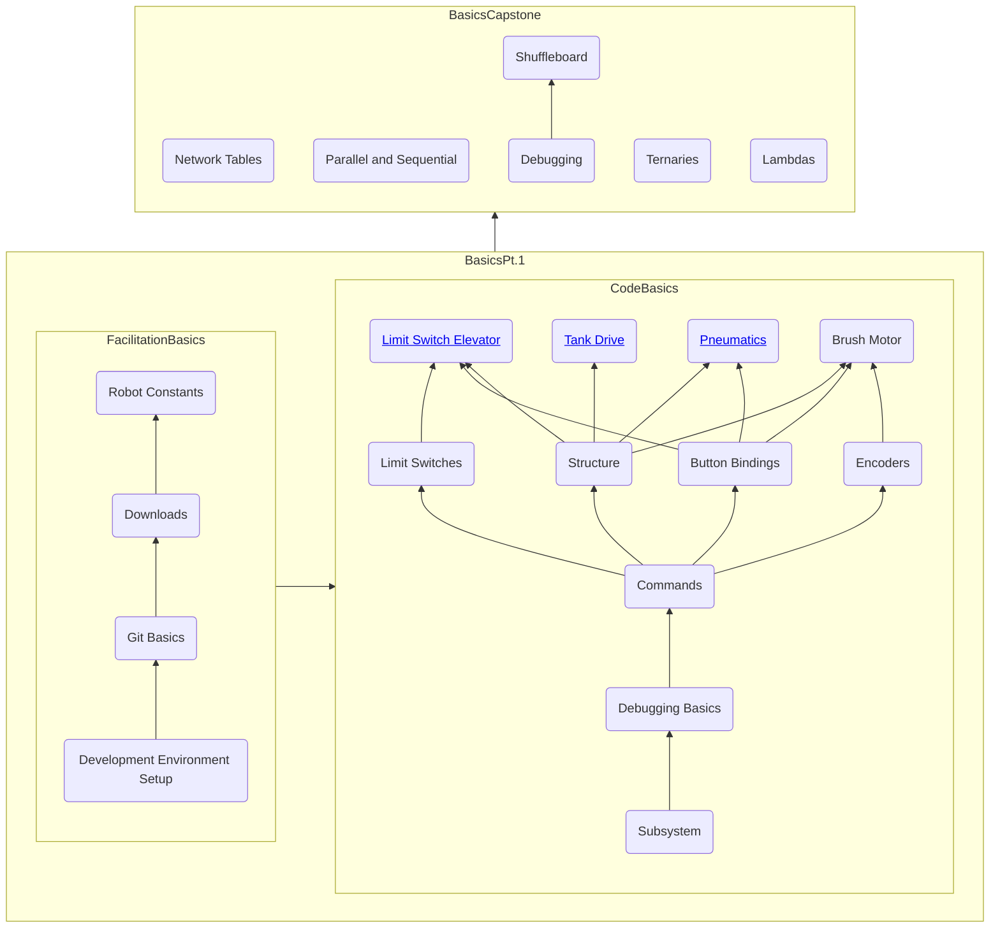

# Training
Software Training structure for Lakemonsters 2635

---
Basics
---

**note: click on nodes for learning links 
# Robot
1. Feedback/feedforward
2. PID
3. Performing System ID on elevator
4. Elevators
5. [Arm](https://github.com/Lakemonsters2635/arm_motor_base)
6. Tank
7. Swerve

# Auto
1. Command scheduler/auto chooser
2. Auto creation
3. Path planner
    - Path planner basics
    - Path planner limitations
1. Vision integration

# Vision
- Limelight
    - Network tables
- Machine learning vision basic
    1. Roboflow
    1. Python
    1. Training the model
    4. Oak camera
    5. Deploying models on oak camera
- Machine learning vision advanced
    1. Network tables (ntcore)
    1. Camera server (cscore)
    6. Data handling (numpy)
    1. Monstervision
    1. AprilTags
    7. Raspberry Pi
        - Development environment
        - WPILibPi
        - Basic Linux commands
        - Deploy Monster vision

# Elementary Java
TBD

# Helpful Links
- Vendor Libraries:
    - [CTRE Library Download](https://store.ctr-electronics.com/software/)
        - The link is at the bottom of the page, get the v5 link.
    - [REV Library Download](https://github.com/REVrobotics/REV-Software-Binaries/releases/tag/revlib-2024.2.0)
        - Located in the read me, use this till they update real docs on REV site
    - [Kauai Labs Library Download](https://pdocs.kauailabs.com/navx-mxp/software/roborio-libraries/java/)
        - Located around the middle of the page, use the online installation method
- [WPILib Java API Docs](https://github.wpilib.org/allwpilib/docs/release/java/index.html)